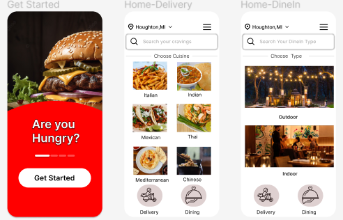
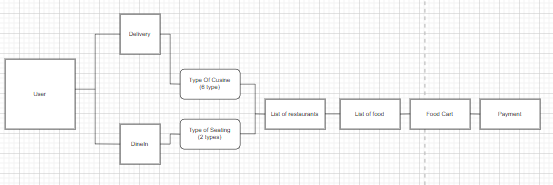

# FoodFleet-Food Delivery App

The objective of the project is to make a app that is similar to the Food Delivery App called Zomato in India.

# Figma Design

Link: https://www.figma.com/file/MvwIeVji0u3yoTV69P35xg/FoodFleet?type=design&node-id=0%3A1&mode=design&t=2CAjZG3tjIkjcjOp-1

# ERD

# MVP 
A food delivery app with 6 cusine and a 2 restaurants with 3 food each.
The user is able to select either from delivery or Dine In
The app should able to setup the cart and then payment page should pop up to complete the order.

# Stretch Goals
Create Log in page and create user Database

